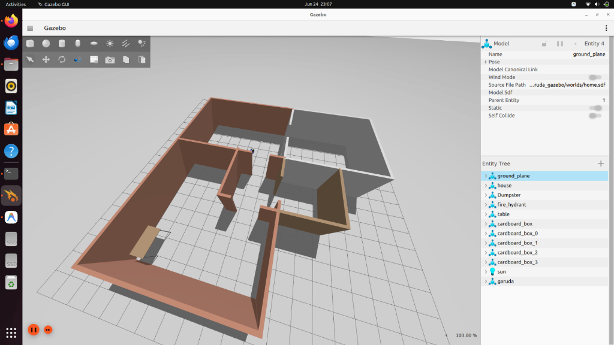
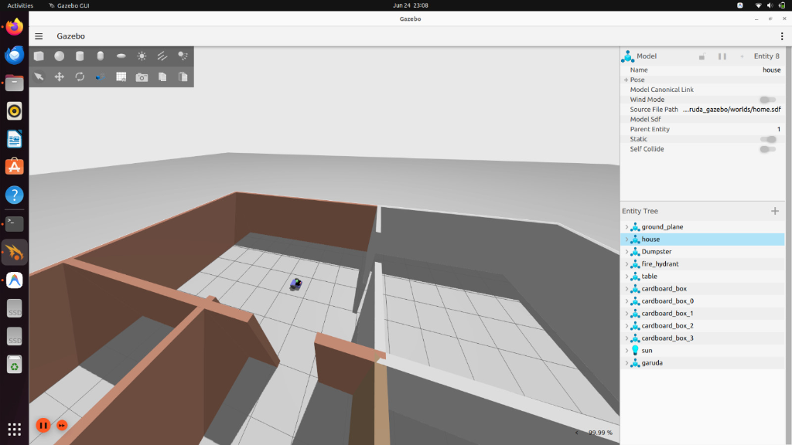
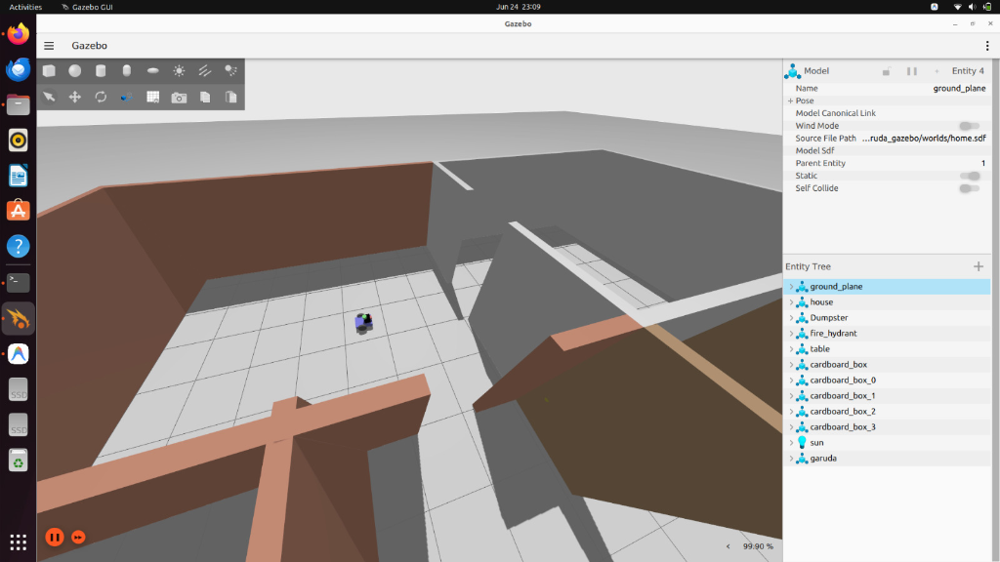
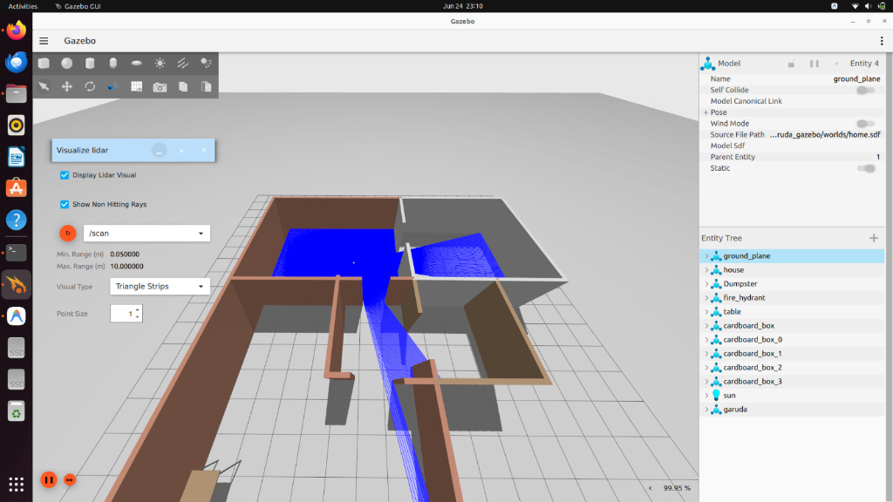
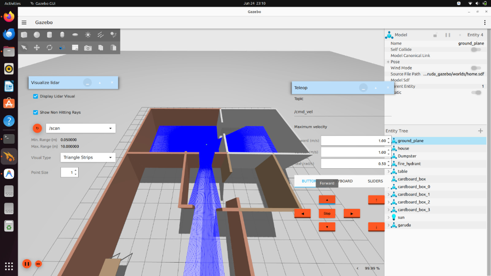
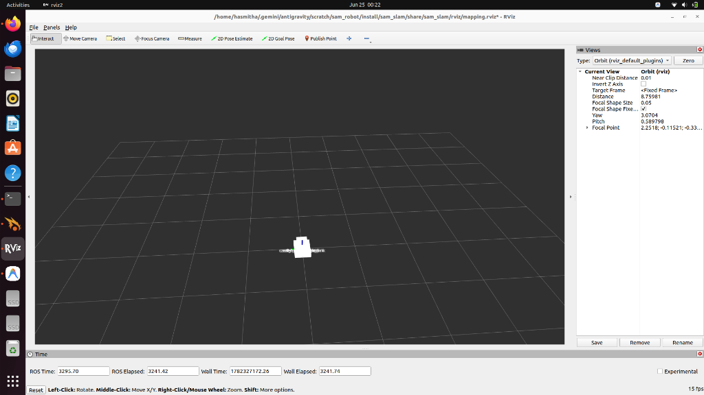

# Sam Robot 🤖

An advanced ROS2 (Humble) autonomous differential drive robot simulation configured for SLAM mapping, localization, and navigation within custom Gazebo Fortress environments.

---

## 📸 Simulation Gallery

Here are screenshots of the **Sam Robot** in its custom-styled simulation environment:

### Orthographic Overview of Home Environment


### Perspective View of Sam Robot (Bright Orange Chassis)


### Interior Detail & Wall Layout


### Lidar Sensor Rays Visualization


### Gazebo Teleoperation Overlay


### Clean RViz Mapping Workspace (Transform Fix Verified)


---

## 🛠️ Architecture & Package Details

The workspace consists of 6 core packages, each responsible for a distinct aspect of the robot's autonomy stack:

### 1. `sam_description`
* **Purpose**: Defines the robot's physical structure, geometry, and visual properties using URDF/Xacro.
* **Details**: It models a differential drive chassis with a custom sensor tower, castor wheels, and sensor joints. It specifies mass, moments of inertia, and visual materials (including a custom **Orange** chassis color). It also contains the Gazebo sensor plugins for Lidar, IMU, GPS, and Joint State Publishers.

### 2. `sam_gazebo`
* **Purpose**: Configures the Gazebo Fortress (Ignition) simulation worlds and handles robot spawning.
* **Details**: Contains customized SDF worlds (`empty.sdf`, `home.sdf`, and `world.sdf`) adapted with bright lighting, custom floor colors, and painted walls to prevent black rendering issues. It includes the spawn scripts that instantiate the robot description in the simulator.

### 3. `sam_ekf`
* **Purpose**: Manages sensor fusion and state estimation.
* **Details**: Utilizes `robot_localization`'s Extended Kalman Filter (EKF) node. It fuses wheel encoder odometry and IMU data (angular velocity Z and linear acceleration X) to generate a smooth, drift-free `/odometry/filtered` topic and the crucial `odom` -> `base_footprint` TF transform.

### 4. `sam_control`
* **Purpose**: Handles teleoperation interfaces.
* **Details**: Houses launch files for joystick controller mappings (`teleop_twist_joy`) and provides bindings to control the robot's linear and angular velocities manually.

### 5. `sam_slam`
* **Purpose**: Performs Simultaneous Localization and Mapping (SLAM).
* **Details**: Uses `slam_toolbox` to generate highly accurate 2D occupancy grid maps in real-time as the robot explores. It publishes the `map` -> `odom` TF transform and coordinates RViz visualization.

### 6. `sam_navigation`
* **Purpose**: Implements autonomous path planning and obstacle avoidance.
* **Details**: Leverages the ROS2 Nav2 stack. It loads saved maps, configures local/global costmaps, uses AMCL for particle-filter-based localization, and executes path planning behaviors to guide the robot to user-selected goal poses safely.

---

## ⚙️ System Requirements
* **Operating System**: Ubuntu 22.04 LTS (Jammy Jellyfish)
* **ROS2 Distro**: Humble Hawksbill
* **Simulator**: Gazebo Fortress (Ignition Gazebo 6)

---

## 📥 Installation Guide

Follow these commands line-by-line to install the dependencies and compile the workspace on your Ubuntu 22.04 system.

### Step 1: Install System and ROS2 Dependencies
Run this command in your terminal to install the Nav2 stack, SLAM toolbox, EKF filters, and Gazebo-ROS bridge packages:
```bash
sudo apt update
sudo apt install -y \
  ros-humble-ros-gz \
  ros-humble-navigation2 \
  ros-humble-nav2-bringup \
  ros-humble-robot-localization \
  ros-humble-slam-toolbox \
  ros-humble-teleop-twist-keyboard \
  ros-humble-teleop-twist-joy \
  ros-humble-joy \
  ros-humble-xacro \
  ros-humble-urdf \
  ros-humble-robot-state-publisher \
  ros-humble-joint-state-publisher \
  ros-humble-joint-state-publisher-gui \
  ros-humble-rviz2 \
  ros-humble-interactive-marker-twist-server
```

### Step 2: Clone and Setup Workspace
Ensure your workspace is located in the recommended directory:
```bash
# Navigate to the workspace
cd /home/hasmitha/.gemini/antigravity/scratch/sam_robot
```

### Step 3: Build the Workspace
Build the packages using `colcon`:
```bash
# Source ROS2 Humble first
source /opt/ros/humble/setup.bash

# Build the project
colcon build --symlink-install
```

---

## 🚀 Launching Sequence

To run the full simulation with mapping or navigation, open a new terminal window for each step, navigate to the workspace directory, and execute the following commands line-by-line.

### **Terminal 1: Start Gazebo World and Spawn Sam Robot**
This command starts Gazebo Sim, loads the bright home layout, spawns the Orange Sam robot, runs the robot state publisher, and starts the EKF filter:
```bash
cd /home/hasmitha/.gemini/antigravity/scratch/sam_robot
source /opt/ros/humble/setup.bash
. install/setup.bash
ros2 launch sam_gazebo spawn_robot.launch.py world:=home.sdf
```

### **Terminal 2: Keyboard Teleoperation**
Use this to drive the robot around manually using keyboard keys:
```bash
cd /home/hasmitha/.gemini/antigravity/scratch/sam_robot
source /opt/ros/humble/setup.bash
. install/setup.bash
ros2 run teleop_twist_keyboard teleop_twist_keyboard
```

### **Terminal 3: SLAM Mapping (Create a Map)**
Launches the SLAM Toolbox and opens RViz, showing the map as the robot drives around:
```bash
cd /home/hasmitha/.gemini/antigravity/scratch/sam_robot
source /opt/ros/humble/setup.bash
. install/setup.bash
ros2 launch sam_slam mapping.launch.py
```

### **Terminal 4: Autonomous Navigation (Navigate a Saved Map)**
If you already have a saved map and want the robot to plan paths autonomously:
```bash
cd /home/hasmitha/.gemini/antigravity/scratch/sam_robot
source /opt/ros/humble/setup.bash
. install/setup.bash
ros2 launch sam_navigation navigation.launch.py
```

---

## 📄 License
This project is licensed under the Apache License 2.0. See the `LICENSE` file for details.

### E-mail:tadavarthyhasmitha@gmail.com
